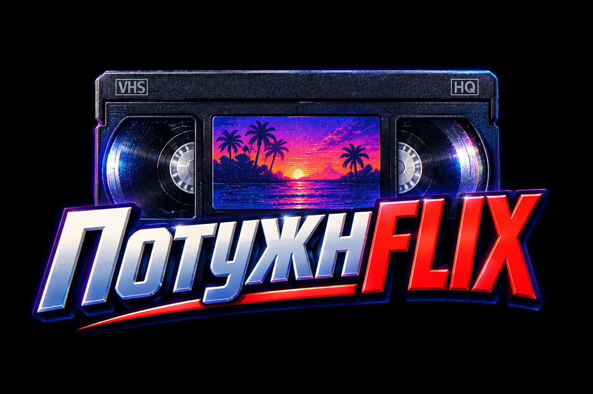

# ПотужнFLIX



A homemade TV box: paste a magnet link on your phone, and the film plays on the TV over HDMI.
See [CLAUDE.md](CLAUDE.md) for the full project description.

## Requirements

- [Node.js](https://nodejs.org/) 20 or newer
- [mpv](https://mpv.io/) available on `PATH` as the `mpv` command

## Installing mpv

### Windows

```powershell
winget install shinchiro.mpv
```

This installs to `C:\Program Files\MPV Player\mpv.exe`, but **does not add it to `PATH`**.
Add it yourself (no admin rights needed):

```powershell
[Environment]::SetEnvironmentVariable("Path", $env:Path + ";C:\Program Files\MPV Player", "User")
```

Open a **new** terminal afterwards so `PATH` is refreshed, then check:

```powershell
mpv --version
```

### Raspberry Pi OS / Debian / Ubuntu

```bash
sudo apt update
sudo apt install mpv
```

### macOS

```bash
brew install mpv
```

## Setup

```bash
npm install
npm run build    # builds the phone remote into web/dist
```

## Running the player (manual test)

```bash
npm run player        # desktop: mpv opens in a window
npm run player:pi     # Raspberry Pi: output straight to HDMI (DRM/KMS)
```

Then type `load <path or URL>` to play a file, and `help` for the command list.

## Playing a magnet link

The box takes magnet links and .torrent files (in the phone remote: "Вибрати .torrent файл"); there is no search.

```bash
npm run play -- "<magnet link>"
npm run play -- "<magnet link>" --episode 3
```

The torrent is added to the download library and played in mpv while it downloads. A torrent
with several videos (a series, or a film split into parts) plays as a playlist: episodes in
order, the next one starts automatically. `--episode <n>` starts from episode `n`. Add
`--serve-only` to skip mpv and only print the local stream URL.

The magnet needs living peers: the torrent's metadata comes from them. If none answer within
90 seconds, you get "no peers found".

Example with a legal test torrent ([Sintel](https://durian.blender.org/), CC-BY):

```bash
npm run play -- "magnet:?xt=urn:btih:08ada5a7a6183aae1e09d831df6748d566095a10&dn=Sintel&tr=udp%3A%2F%2Ftracker.opentrackr.org%3A1337&tr=wss%3A%2F%2Ftracker.openwebtorrent.com&ws=https%3A%2F%2Fwebtorrent.io%2Ftorrents%2F&xs=https%3A%2F%2Fwebtorrent.io%2Ftorrents%2Fsintel.torrent"
```

## Series

A series is a torrent with several episodes; paste its magnet link the same way as a film.
The box plays the episodes in order and remembers where you stopped: playing the series again
continues from the last episode.

- Episodes are sorted naturally (`E2` before `E10`); samples, trailers and extras are skipped.
- While you watch an episode, the next one downloads too, so it starts right away.
- `next` / `prev` control actions switch episodes.
## Downloads

Everything played or downloaded goes into the download library, stored in `$TMPDIR/tvbox-cache`
(set `TVBOX_CACHE` to change it; on the Pi this will be the USB drive). It survives restarts:
unfinished downloads continue where they stopped.

- While a film plays, other downloads wait, so the stream gets all the bandwidth.
- An unfinished film keeps downloading after you stop watching, so it starts instantly next time.
- Finished films play straight from disk.
- Automatic cleanup (films marked "keep" are never touched):
  - finished films: 30 days after last watched;
  - unfinished downloads: after 7 days without progress;
  - when free disk space drops under 5 GB: least recently used films first.

Don't run `npm start` and `npm run play` at the same time: they would share the same library.

## Running the backend

```bash
npm start        # desktop
npm run start:pi # Raspberry Pi: mpv outputs straight to HDMI
```

Listens on port 8080 on all interfaces (override with `PORT` / `HOST`) and prints the LAN
address to open on your phone.

## The TV picture

When nothing plays, the TV shows a synthwave night (striped sun, palms, a moving neon grid) with
"ВСТАВТЕ КАСЕТУ", a clock, a QR code and the address of the phone remote, and what is downloading.
While a film loads it shows an old-VCR blue screen, "ЗАВАНТАЖУЮ КАСЕТУ..."; during the film,
VCR-style messages: ▶ PLAY, ❚❚ PAUSE with the tape counter, ▶▶ / ◀◀ after seeking, a green
volume bar. It is all drawn by mpv's on-screen display, so it works on the Pi without a desktop.

After 20 minutes on the idle screen with nobody using the remote, the TV goes dark with a dim
clock (screen saver; downloads go on). Opening the remote or pressing anything brings it back.

On the Pi, the box also turns the TV on and switches it to the right input by itself (HDMI-CEC)
when it starts up and whenever the screen saver ends, and puts the TV in standby when the screen
saver starts.

- `TVBOX_SAVER_MIN` changes the screen saver delay in minutes (`0` = never).
- `TVBOX_CEC=off` disables the HDMI-CEC control, for a TV that reacts badly to it.
- `TVBOX_URL` changes the address shown (default: `http://<computer's IP>:8080`).
- `TVBOX_MPV_ARGS` passes extra mpv options, e.g. `TVBOX_MPV_ARGS="--geometry=960x540"` for a
  smaller window while developing.

## Phone remote

Open the address the backend prints (e.g. `http://192.168.1.20:8080`) on your phone, in the same
Wi‑Fi network. To get an app icon, use "Add to Home Screen" (Safari) / "Install app" or
"Add to home screen" (Chrome).

- **Пульт** (remote): a VCR deck. Display with the tape counter (tap it to switch to time remaining), seek bar,
  play/pause, ±10 s, previous/next episode, volume, audio and subtitle tracks, stop. When nothing
  plays: the magnet form and "continue watching" (resumes exactly where it was left off). Below:
  "Стан приставки", the box's CPU temperature, power / overheating warnings, CPU, memory, network
  and uptime.
- **Полиця** (shelf): every film as a VHS tape. The tape moves from the left reel to the right one
  as it downloads. Pause/resume a download, protect a tape from automatic erasing (the lock tab),
  erase it, pick a series episode. Playback always resumes where it stopped (per episode); a title
  watched through to the end starts over from the beginning next time.
- **Історія переглядів** (watch history, below the shelf): everything watched recently, even after
  its download is gone — with when, how far you got, and a button to either continue it (if it's
  still on the shelf) or add it back by its magnet link (rebuilt from the torrent's info hash, no
  tracker needed).

The UI is in Ukrainian. Windows Firewall may ask to allow Node.js on first start: allow it on
private networks, or the phone can't connect.

To work on the UI with hot reload, run the backend and the Vite dev server side by side, then open
`http://<computer's IP>:5173` on the phone:

```bash
npm start
```

```bash
npm run dev:web
```

## API

The remote uses this API; it also works with `curl`:

| Method | Path | Body / query |
| --- | --- | --- |
| POST | `/api/play` | `{ "magnet": "magnet:?..." }` or `{ "id": "...", "episode": 0 }` (from the library; `episode` optional) |
| POST | `/api/control` | `{ "action": "pause" }`, `{ "action": "seekBy", "value": 10 }`, … |
| POST | `/api/stop` | |
| GET | `/api/status`, `/api/tracks` | |
| GET | `/api/downloads` | list of downloads |
| POST | `/api/downloads` | `{ "magnet": "magnet:?..." }`: download without playing |
| POST | `/api/play/torrent`, `/api/downloads/torrent` | the .torrent file as the body (`Content-Type: application/x-bittorrent`, ≤ 10 MB) |
| PATCH | `/api/downloads/:id` | `{ "paused": true }`, `{ "keep": true }` |
| DELETE | `/api/downloads/:id` | deletes the files |
| GET | `/api/storage` | free / total / used disk space and cleanup settings |
| GET | `/api/health` | CPU temperature, undervoltage / overheating warnings, CPU, memory, network, uptime |
| GET | `/api/history` | watched titles, most recent first, kept even after the download is deleted |
| DELETE | `/api/history/:id`, `/api/history` | removes one entry, or clears all of them |
| WS | `/ws` | pushes `{ "type": "status", ... }` (≤ 4/s) and `{ "type": "downloads", "items": [...] }` (≤ 1/s) |

Control actions: `play`, `pause`, `toggle`, `seekBy`, `seekTo`, `volume`, `volumeBy`, `audio`, `sub`, `next`, `prev`.
